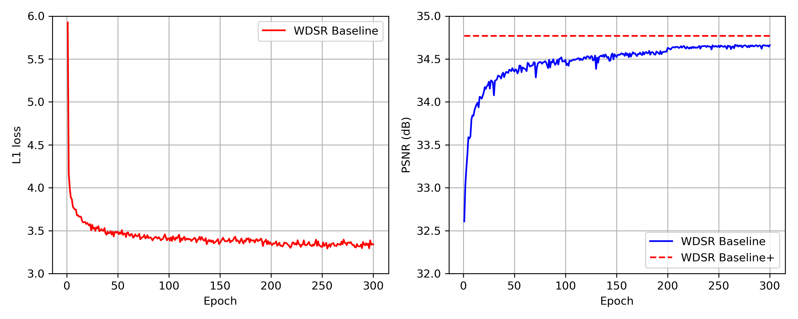

# WDSR

This repository is implementation of the ["Wide Activation for Efficient and Accurate Image Super-Resolution"](https://arxiv.org/abs/1808.08718).

## Requirements

- PyTorch 1.1.0
- TensorBoard 1.14.0
- Numpy 1.15.4
- Pillow-SIMD 5.3.0.post1
- h5py 2.8.0
- tqdm 4.30.0

## Prepare dataset

To prepare dataset used in experiments, first download dataset files from this [link](https://data.vision.ee.ethz.ch/cvl/DIV2K) and organize it as shown below.

```bash
/YOUR_STORAGE_PATH/DIV2K
├── DIV2K_train_HR
├── DIV2K_train_LR_bicubic
│   └── X2
│   └── X3
│   └── X4
├── DIV2K_valid_HR
├── DIV2K_valid_LR_bicubic
│   └── X2
│   └── X3
│   └── X4
├── DIV2K_train_HR.zip
├── DIV2K_train_LR_bicubic_X2.zip
├── DIV2K_train_LR_bicubic_X3.zip
├── DIV2K_train_LR_bicubic_X4.zip
├── DIV2K_valid_HR.zip
├── DIV2K_valid_LR_bicubic_X2.zip
├── DIV2K_valid_LR_bicubic_X3.zip
└── DIV2K_valid_LR_bicubic_X4.zip
```

By default, we use "0001-0800.png" images to train the model and "0801-0900.png" images to validate the training.
All experiments also use images with BICUBIC degradation on RGB space.

## Training

### WDSR Baseline (=WDSR-A) Example

```bash
python train.py --dataset-dir "/YOUR_STORAGE_PATH/DIV2K" \
                --output-dir "/YOUR_STORAGE_PATH/output" \
                --model "WDSR-A" \
                --scale 2 \
                --n-feats 32 \
                --n-res-blocks 16 \
                --expansion-ratio 4 \
                --res-scale 1.0 \
                --lr 1e-3
```

### WDSR-B Example

```bash
python train.py --dataset-dir "/YOUR_STORAGE_PATH/DIV2K" \
                --output-dir "/YOUR_STORAGE_PATH/output" \
                --model "WDSR-B" \
                --scale 2 \
                --n-feats 32 \
                --n-res-blocks 16 \
                --expansion-ratio 6 \
                --low-rank-ratio 0.8 \
                --res-scale 1.0 \
                --lr 1e-3
```

If you want to modify more options, see the `core/option.py` file.

## Evaluation

Trained model is evaluated on DIV2K validation 100 images. If you want to use self-ensemble for evaluation, add `--self-ensemble` option.

```bash
python eval.py --dataset-dir "/YOUR_STORAGE_PATH/DIV2K" \
               --checkpoint-file "/YOUR_STORAGE_PATH/output/WDSR-A-f32-b16-r4-x2-best.pth.tar"
```

| Model | Scale | Residual Blocks | Parameters | PSNR | Pre-trained Model |
|-------|-------|-----------------|------------|------|-------------------|
| WDSR Baseline<sup> 1)</sup> | x2 | 16 | 1.19M | 34.67 dB | [Download](https://www.dropbox.com/s/nuiasqjw8kx241v/WDSR-A-f32-b16-r4-x2-best.pth.tar?dl=0) |
| WDSR Baseline+<sup> 2)</sup> | x2 | 16 | 1.19M | 34.77 dB | - |

<sup>1)</sup> filters=32, res-blocks=16, expansion-ratio=4, res-scale=1.0<br />
<sup>2)</sup> filters=32, res-blocks=16, expansion-ratio=4, res-scale=1.0, with self-ensemble<br />

<center></center>

## References

- Yu, Jiahui, et al. "Wide activation for efficient and accurate image super-resolution." arXiv preprint arXiv:1808.08718 (2018).
- Fan, Yuchen, Jiahui Yu, and Thomas S. Huang. "Wide-activated deep residual networks based restoration for BPG-compressed images." Proc. IEEE Conf. Comput. Vis. Pattern Recognit. Workshops. 2018.
- Lim, Bee, et al. "Enhanced deep residual networks for single image super-resolution." Proceedings of the IEEE Conference on Computer Vision and Pattern Recognition Workshops. 2017.
